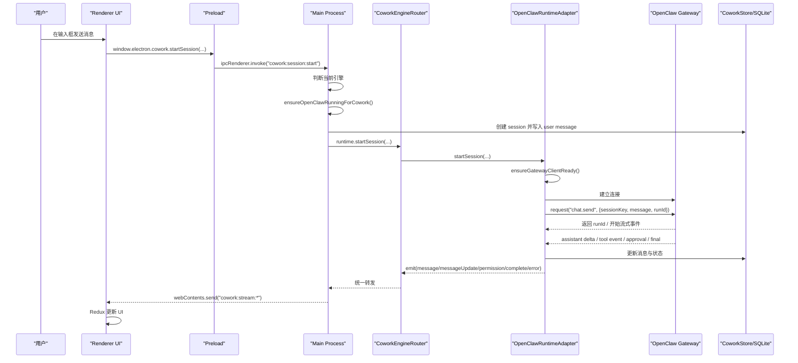

# QingShuClaw 架构梳理

## 附录：2026-03-30 架构问答记录

### 1. IPC 机制、OpenClaw IPC 机制，以及当前项目如何与 OpenClaw 结合

**问题**

> 扫描一下项目，看一下当前项目中的 IPC 机制以及 IPC 的作用是什么，openclaw 的 IPC 机制是什么样的？当前项目是如何与 openclaw 进行结合的？

**回答**

这个项目里同时存在两套“进程间通信”：

1. Electron 内部 IPC：`renderer ↔ preload ↔ main`
2. OpenClaw 运行时通信：`main ↔ OpenClaw gateway 本地子进程`

#### 1.1 当前项目中的 IPC 是什么

- 渲染进程不能直接访问主进程能力，而是通过 `preload` 暴露的白名单 API 调主进程。
- `preload` 里统一通过 `contextBridge.exposeInMainWorld('electron', ...)` 暴露接口。
- 请求/响应类能力主要走 `ipcRenderer.invoke(...)` / `ipcMain.handle(...)`。
- 主进程到前端的流式消息主要走 `webContents.send(...)`。

关键位置：

- [preload.ts](/Users/wuyongsheng/workspace/projects/QingShuClaw/src/main/preload.ts)
- [main.ts](/Users/wuyongsheng/workspace/projects/QingShuClaw/src/main/main.ts)

#### 1.2 IPC 的作用是什么

IPC 在这个项目中的作用主要有四类：

1. UI 调主进程能力  
   例如会话启动、配置读取、日志、文件选择、窗口控制、IM 配置等。
2. 主进程把运行时事件推回前端  
   例如 `cowork:stream:message`、`messageUpdate`、`permission`、`complete`、`error`。
3. 隔离不安全能力  
   主进程持有文件系统、子进程、SQLite、OpenClaw、IM 网关等系统能力，前端只拿到最小暴露面。
4. 统一会话协议  
   无论后端引擎是 `yd_cowork` 还是 `openclaw`，前端都只消费统一的 `cowork` IPC。

#### 1.3 OpenClaw 的“IPC 机制”是什么样的

OpenClaw 这一层严格说不是 Electron IPC，而是：

- 主进程通过 `OpenClawEngineManager` 拉起本地 `OpenClaw gateway` 子进程。
- 子进程通过 `loopback + token` 暴露本地连接。
- 主进程里的 `OpenClawRuntimeAdapter` 再通过 GatewayClient 和它通信。

OpenClaw gateway 侧的核心方法包括：

- `chat.send`
- `chat.abort`
- `chat.history`
- `sessions.list`
- `exec.approval.resolve`

对应位置：

- [openclawEngineManager.ts](/Users/wuyongsheng/workspace/projects/QingShuClaw/src/main/libs/openclawEngineManager.ts)
- [openclawRuntimeAdapter.ts](/Users/wuyongsheng/workspace/projects/QingShuClaw/src/main/libs/agentEngine/openclawRuntimeAdapter.ts)

#### 1.4 当前项目如何与 OpenClaw 结合

项目与 OpenClaw 的结合不是“前端直接调 OpenClaw”，而是中间多了一层 Cowork 编排：

1. 前端调用 `window.electron.cowork.startSession(...)`
2. 主进程根据当前配置判断引擎是不是 `openclaw`
3. 如果是，则先 `ensureOpenClawRunningForCowork()`
4. 再通过 `CoworkEngineRouter` 把请求路由到 `OpenClawRuntimeAdapter`
5. `OpenClawRuntimeAdapter` 调用 gateway 的 `chat.send`
6. gateway 返回流式事件
7. 主进程把这些事件转成统一的 `cowork:stream:*` 发回前端

另外，项目还会把下列信息统一同步进 `openclaw.json`：

- Cowork 配置
- 模型/API 配置
- Skills
- MCP Bridge
- IM 平台配置
- Agents 与平台绑定

对应位置：

- [coworkEngineRouter.ts](/Users/wuyongsheng/workspace/projects/QingShuClaw/src/main/libs/agentEngine/coworkEngineRouter.ts)
- [openclawConfigSync.ts](/Users/wuyongsheng/workspace/projects/QingShuClaw/src/main/libs/openclawConfigSync.ts)
- [openclawChannelSessionSync.ts](/Users/wuyongsheng/workspace/projects/QingShuClaw/src/main/libs/openclawChannelSessionSync.ts)

#### 1.5 工程结论

- `KISS`：前端只面向 `cowork`，不直接面向 OpenClaw，边界清晰。
- `SOLID`：UI、系统能力、引擎适配、运行时执行分层明确。
- `DRY`：前端对不同执行引擎复用同一套流式协议。
- 潜在问题：很多 IPC channel 仍是字符串字面量，后续可以考虑常量化统一。

### 2. 与传统 BS / CS 架构相比，这样设计的好处是什么

**问题**

> 与传统的BS/CS架构相比，这样设计的好处是什么？

**回答**

相对传统 `BS`，这套架构最大的优势是本地能力和控制力更强：

- 能直接操作本地工作目录、文件系统、日志、截图、子进程
- 能稳定接入本地 SQLite、IM 网关、OpenClaw runtime
- 许多敏感配置和 token 可只保留在本地
- 不需要所有能力都依赖远端服务中转

相对传统“单体式 CS”，这套架构的好处是职责更清楚：

- `renderer` 管 UI
- `main` 管系统能力和调度
- `cowork` 管统一会话模型
- `OpenClaw gateway` 管 agent 执行和通道插件

这样带来的收益：

1. 隔离性更好  
   OpenClaw 出问题时，不一定拖垮整个 Electron 应用。
2. 可替换性更强  
   当前就已经支持 `yd_cowork` 和 `openclaw` 两套执行引擎。
3. 可扩展性更强  
   MCP、IM、定时任务、AskUserQuestion、Agent 绑定等都更容易挂接。
4. 更适合“本地 AI 助手”场景  
   这是传统 BS 很难优雅完成的场景。

推荐理解：

- `cowork` 是会话编排层
- `OpenClaw` 是执行引擎层
- Electron IPC 是 UI 与主进程之间的桥
- Gateway WS/RPC 是主进程与 OpenClaw 之间的桥

### 3. 更清晰地认识当前系统：IPC 数量、进程、协作方式、Cowork 与 OpenClaw 的职责

**问题**

> 我需要有一个更清晰的认知，比如有多少IPC？它们在哪几个进程里？是如何协作的？cowork的作用是什么？cowork与OPENCLAW的职责是什么，如何协作的，协作是通过哪些IPC进行的？

**回答**

#### 3.1 涉及哪几个进程

当前最核心的几个运行单元是：

1. `renderer`  
   React UI、Redux 状态、页面交互
2. `preload`  
   不是独立进程，而是 renderer 的隔离桥接层
3. `main`  
   Electron 主进程，负责系统能力、配置、SQLite、Cowork 路由、OpenClaw 管理
4. `OpenClaw gateway`  
   主进程拉起的本地子进程

#### 3.2 当前有多少 IPC

按 `src/main/main.ts` 中直接注册的字符串 channel 统计：

- `ipcMain.handle`：110 个
- `ipcMain.on`：5 个

其中和本轮问题直接相关的主要是：

- `cowork:*` 请求型 IPC：23 个
- `openclaw:engine:*` 请求型 IPC：4 个
- `im:*` 请求型 IPC：14 个

和流式事件相关的主要是：

- `cowork:stream:message`
- `cowork:stream:messageUpdate`
- `cowork:stream:permission`
- `cowork:stream:permissionDismiss`
- `cowork:stream:complete`
- `cowork:stream:error`
- `cowork:sessions:changed`
- `openclaw:engine:onProgress`

#### 3.3 Electron IPC 主要发生在哪几层

1. `renderer -> preload -> main`
   - 使用 `ipcRenderer.invoke(...)`
   - 对应 `ipcMain.handle(...)`

2. `main -> renderer`
   - 使用 `webContents.send(...)`
   - 前端通过 `ipcRenderer.on(...)` 监听

3. `main -> OpenClaw gateway`
   - 不是 Electron IPC
   - 使用本地 WebSocket / RPC

#### 3.4 Cowork 的作用是什么

`cowork` 不是某一个单独进程，而是项目里的“统一 AI 工作会话系统”。

它的职责是：

- 管理会话与消息
- 对前端暴露统一接口
- 管理权限请求与响应
- 管理流式消息更新
- 管理会话状态
- 在不同执行引擎之间做统一封装

简化理解：

`cowork = 应用自己的统一会话编排层`

#### 3.5 OpenClaw 的职责是什么

`OpenClaw` 在这里更像“外部执行引擎 / 本地 gateway runtime”。

它的职责是：

- 真正执行 agent 会话
- 提供工具调用能力
- 提供会话历史和 session 管理
- 承接 IM 通道插件
- 承接 cron / agent binding / OpenClaw 配置

简化理解：

`OpenClaw = 真正干活的 agent 运行时`

#### 3.6 Cowork 与 OpenClaw 如何协作

协作链路分三段：

**第一段：前端到主进程**

- 前端调 `window.electron.cowork.startSession(...)`
- 对应 `ipcRenderer.invoke('cowork:session:start', ...)`
- 主进程 `ipcMain.handle('cowork:session:start', ...)` 接住

**第二段：主进程内部编排**

- 主进程判断当前引擎是 `openclaw` 还是 `yd_cowork`
- 统一交给 `CoworkEngineRouter`
- 若当前引擎是 `openclaw`，则转发到 `OpenClawRuntimeAdapter`

**第三段：主进程到 OpenClaw gateway**

- `OpenClawRuntimeAdapter` 调 `chat.send/chat.abort/chat.history/...`
- OpenClaw 返回事件流
- 主进程再把事件转为 `cowork:stream:*`
- 发回前端 UI

#### 3.7 协作时通过哪些 IPC

`cowork` 和前端之间走的主要是 Electron IPC：

- `cowork:session:start`
- `cowork:session:continue`
- `cowork:session:stop`
- `cowork:permission:respond`
- `cowork:config:get`
- `cowork:config:set`
- `cowork:stream:*`

`main` 和 `OpenClaw` 之间则不是 Electron IPC，而是 gateway RPC：

- `chat.send`
- `chat.abort`
- `chat.history`
- `sessions.list`
- `exec.approval.resolve`

#### 3.8 一句话总模型

- `cowork` 负责统一会话语义
- `OpenClaw` 负责执行与通道能力
- Electron IPC 负责 UI 和主进程通信
- Gateway RPC 负责主进程和 OpenClaw 通信

### 4. 单次消息发送时序图、这样设计的好处，以及 OpenClaw 异常时的影响

**问题**

> 继续画一张更具体的“单次消息发送时序图”，并告诉我这样设计的好处是什么？如果openclaw异常了会有哪些影响？

**回答**

#### 4.1 单次消息发送时序图



#### 4.2 这样设计的好处

1. 分层清晰  
   UI、主进程、会话编排、执行引擎分工明确。
2. 可替换  
   `CoworkEngineRouter` 允许后端执行引擎替换而不影响前端。
3. 隔离性更好  
   OpenClaw 挂掉不一定把整个应用一起带崩。
4. 更适合本地 AI 工具场景  
   支持本地文件、子进程、SQLite、IM、定时任务等。
5. 更利于扩展  
   新增 provider、gateway 插件、MCP、agent 都更顺手。

#### 4.3 如果 OpenClaw 异常了，会有什么影响

**情况 1：OpenClaw 启动不起来**

影响：

- 当前引擎为 `openclaw` 时，新的 `startSession/continueSession` 会失败
- IM 通道和依赖 OpenClaw 的能力也会受影响

不直接受影响：

- Electron UI 仍可打开
- 本地 SQLite 历史仍可查看
- 配置页面和非 OpenClaw 的普通功能仍可使用

**情况 2：OpenClaw 在执行中断开**

影响：

- 当前运行中的会话会被标记为 `error`
- 流式输出会中断
- 工具调用与权限确认流程会中断

项目已经做了：

- 将活跃 session 标记为错误
- 尝试自动重连 gateway client

**情况 3：OpenClaw 在配置同步 / 重启阶段异常**

影响：

- `openclaw.json` 可能已更新但 gateway 未成功运行
- OpenClaw 相关能力暂时不可用

项目中的保护：

- 如果当前有活跃会话，会尽量延迟重启，避免直接打断执行

**情况 4：对 IM 的影响**

- 新的通道消息可能无法被 OpenClaw 接入
- 通道会话可能无法同步成 Cowork 本地 session
- 增量历史同步可能中断

#### 4.4 总结

OpenClaw 异常最主要损失的是：

- 执行能力
- IM / 通道接入能力

而不是整个应用彻底不可用。

### 5. Cowork 是否真的使用了 Claude Agent SDK

**问题**

> Cowork is the core feature of LobsterAI — an AI working session system built on the Claude Agent SDK.这里面有使用claude 的agent sdk吗

**回答**

有，而且是实打实在用。

#### 5.1 证据

1. `package.json` 里直接依赖了 Claude Agent SDK  
   [`package.json`](/Users/wuyongsheng/workspace/projects/QingShuClaw/package.json)
2. 存在专门的 SDK 动态加载器 `loadClaudeSdk()`  
   [`claudeSdk.ts`](/Users/wuyongsheng/workspace/projects/QingShuClaw/src/main/libs/claudeSdk.ts)
3. `CoworkRunner` 里真正调用了 SDK 的 `query(...)`  
   [`coworkRunner.ts`](/Users/wuyongsheng/workspace/projects/QingShuClaw/src/main/libs/coworkRunner.ts)
4. 存在 `ClaudeRuntimeAdapter` 用于把 Claude SDK 适配为统一运行时  
   [`claudeRuntimeAdapter.ts`](/Users/wuyongsheng/workspace/projects/QingShuClaw/src/main/libs/agentEngine/claudeRuntimeAdapter.ts)

#### 5.2 但要注意一点

当前项目不是“只有 Claude Agent SDK 一种后端”。

而是：

- `yd_cowork` -> 走 Claude Agent SDK
- `openclaw` -> 走 OpenClaw gateway

因此，更准确的说法不是：

`Cowork built on the Claude Agent SDK`

而应该是：

`Cowork 是统一 AI working session 系统，支持 Claude Agent SDK 后端和 OpenClaw 后端。`

### 6. `yd_cowork` 是什么意思

**问题**

> yd_cowork是指什么？

**回答**

`yd_cowork` 在当前项目里不是一个独立产品名，而是一个**引擎标识符**。

它表示：

**项目内置的 Cowork 执行引擎，也就是基于 Claude Agent SDK 的那条运行链路。**

代码与文档中已有明确含义：

- 文档中写明：`yd_cowork - Built-in Claude Agent SDK runner`
- 路由器中，`yd_cowork` 对应 `claudeRuntime`

它的执行链路可以概括为：

`yd_cowork -> ClaudeRuntimeAdapter -> CoworkRunner -> Claude Agent SDK`

补充说明：

- 我没有在代码中看到 `yd` 缩写的明确全称
- 因此不能严谨地断言它原本代表什么英文
- 但从当前代码语义上看，它就是“内置 Cowork 引擎”的内部命名

### 7. `yd_cowork` 只能使用 Claude 模型吗，还是所有模型都可以使用

**问题**

> yd_cowork中只能使用claude模型吗？还是所有的模型都可以使用？

**回答**

不是“只能用 Claude 模型”，但也不是“所有模型都一定能用”。

更准确地说：

**`yd_cowork` 可以使用多种模型，但前提是这些模型能被当前这套 Claude Agent SDK + 兼容层正确适配。**

#### 7.1 支持的两大类

1. `Anthropic 兼容`模型  
   会直接以 `baseURL + apiKey + model` 方式供 Claude SDK 使用。
2. `OpenAI 兼容`模型  
   会先经过项目内置的 `OpenAI compatibility proxy` 做协议转换，再交给 Claude SDK。

#### 7.2 为什么不是“所有模型都可以”

因为 Claude Agent SDK 本质上期待的是：

- 支持 agent 会话
- 支持工具调用
- 支持流式事件

如果某个模型只是普通聊天模型，或者虽然声称兼容 OpenAI，但在工具调用、system message、stream、token 字段等方面和预期差异很大，就可能出现兼容问题。

项目里已经为此写了大量兼容逻辑：

- provider 路由
- apiFormat 处理
- OpenAI 兼容代理
- 对部分 provider 的 tool / role / token 字段修正

#### 7.3 代码能明确说明什么

- `yd_cowork` 会读取“当前配置的 provider/model”，不是写死 Claude
- 最终使用的模型来自 `matched.modelId`
- provider 可以走 `anthropic` 或 `openai` 兼容格式

因此：

- Claude 模型当然可以用
- 其他经兼容层适配的模型也可以用
- 但不是所有任意模型都能保证完整支持 agent 工具链

#### 7.4 实用结论

判断某个模型能不能用于 `yd_cowork`，看三点：

1. 当前 provider 是否被项目识别和启用
2. 是否能以 `Anthropic` 或 `OpenAI` 兼容接口提供服务
3. 是否支持工具调用与流式输出

简化结论：

`yd_cowork` 不是只能用 Claude；它支持多 provider、多模型。  
但它也不是“任何模型都能无脑可用”，而是“被这套 Claude SDK + 兼容代理成功适配的模型可用”。`

### 8. 当前 QingShuClaw 的记忆管理机制是什么样的

**问题**

> 当前 QingShuClaw 中的记忆管理机制是什么样的？

**回答**

当前项目里的“记忆”不是单一实现，而是**双轨机制**：

1. `OpenClaw / Agent 长期记忆文件`：工作区下的 `MEMORY.md`
2. `结构化用户记忆库`：SQLite 中的 `user_memories` / `user_memory_sources`

这两套能力现在是并存的，但职责不完全一样。

#### 8.1 面向 OpenClaw 的长期记忆：`MEMORY.md`

当前设置页里用户直接看到和操作的“记忆管理”，实际读写的是工作目录下的 `MEMORY.md`。

- Settings 的记忆页明确展示了 `MEMORY.md` 路径，并把它当成长期记忆文件。
- 对记忆的增删改查 IPC 也直接落在 `MEMORY.md` 上，而不是 SQLite。
- OpenClaw 的系统提示里要求 Agent 每次会话先读 `SOUL.md`、`USER.md`、当日/昨日 `memory/YYYY-MM-DD.md`，以及主会话里的 `MEMORY.md`。
- OpenClaw workspace 同步时，也会保证 `MEMORY.md` 文件存在。

可以把这条链路理解为：

`Settings UI -> cowork:memory:* IPC -> openclawMemoryFile.ts -> 工作区/MEMORY.md -> OpenClaw 自动索引/检索`

特点：

- `MEMORY.md` 是**文件型长期记忆**，更偏向“可见、可编辑、可迁移”的知识底稿。
- 只把 Markdown 顶层 bullet 行 `- text` 当作记忆条目。
- 非 bullet 内容、标题、说明文字会被尽量保留。
- 记忆条目的 `id` 是内容指纹，因此修改文本会生成新的 `id`。

#### 8.2 结构化记忆库：SQLite `user_memories`

项目里还保留了一套更细粒度的结构化记忆系统，核心数据在 SQLite：

- `user_memories`
- `user_memory_sources`

这套系统支持：

- `confidence`
- `is_explicit`
- `status(created/stale/deleted)`
- `last_used_at`
- 记忆来源追踪：关联到 `session_id`、`message_id`、`role`

它的主要职责不是“给用户手工维护 Markdown 文件”，而是：

1. 自动从对话中抽取候选记忆
2. 对候选记忆做规则判断和可选 LLM 复审
3. 去重、合并、软删除、标记 stale
4. 在 `yd_cowork` 路径下，把结构化记忆注入 prompt

#### 8.3 自动抽取机制

自动抽取逻辑主要在：

- `coworkMemoryExtractor.ts`
- `coworkMemoryJudge.ts`
- `CoworkRunner.applyTurnMemoryUpdatesForSession()`
- `CoworkStore.applyTurnMemoryUpdates()`

执行时机：

- 当一轮对话结束后，`CoworkRunner` 会取最近一条 `user` 和最近一条非 thinking 的 `assistant` 消息。
- 然后异步调用 `applyTurnMemoryUpdates(...)`，从这一轮里抽取记忆变化。

抽取规则分两类：

1. 显式记忆命令
   - 如“记住…… / 保存到记忆…… / forget this ……”等
2. 隐式个人事实/偏好
   - 如身份、拥有关系、长期偏好、回答风格偏好

同时也会排除很多不适合写入长期记忆的内容：

- 问题句
- 临时任务
- 新闻/当天信息
- 报错、异常、命令行步骤
- 助手工作流提示语

#### 8.4 判断与过滤机制

抽取出来的候选记忆不会直接入库，还会经过一层 judge：

- 先用规则分数判断
- 如果是边界情况，并且开启了 `memoryLlmJudgeEnabled`，再调用一次当前模型做二次判定

这里还有 guard level：

- `strict`
- `standard`
- `relaxed`

guard level 会影响隐式记忆的通过阈值。

#### 8.5 `yd_cowork` 如何使用这些记忆

在内置 `yd_cowork` 引擎路径下，结构化记忆会被直接注入 prompt：

- `CoworkRunner.buildUserMemoriesXml()` 会把 `user_memories` 中 `status='created'` 的记忆转成 `<userMemories>` XML 块
- 然后通过 `buildPromptPrefix()` 拼到用户 prompt 前面
- 系统提示里还会明确告诉模型：`<userMemories>` 是稳定个人事实

这说明：

- `yd_cowork` 更依赖 **SQLite 结构化记忆**
- `OpenClaw` 更依赖 **工作区文件记忆（MEMORY.md + daily memory）**

#### 8.6 当前 UI 层的实际表现

虽然配置项里还保留了：

- `memoryEnabled`
- `memoryImplicitUpdateEnabled`
- `memoryLlmJudgeEnabled`
- `memoryGuardLevel`
- `memoryUserMemoriesMaxItems`

但当前设置页里用户直接管理的记忆 CRUD，已经主要面向 `MEMORY.md` 了。

而且这里存在一个值得注意的架构现状：

- Settings 里的记忆列表/统计来自 `MEMORY.md`
- 结构化字段如 `confidence`、`explicit/implicit`、`stale/deleted` 在当前 UI 这条链路里并没有完整保真
- `cowork:memory:getStats` 现在对文件记忆直接返回“total=entries.length，且都按 created/explicit 计”

因此，**当前“记忆管理 UI”与“结构化记忆引擎”并不是完全同一套数据模型**。

#### 8.7 SQLite 与 `MEMORY.md` 的关系

两者现在不是完全割裂的，项目里做了一个过渡：

- 当用户第一次打开记忆列表时，会触发一次懒迁移
- 把 SQLite 里仍处于活跃状态的 `user_memories` 迁移到 `MEMORY.md`
- 迁移完成后用 `openclawMemory.migration.v1.completed` 标记

所以更准确的说法是：

- `SQLite user_memories` 是**旧的结构化记忆底座 + `yd_cowork` 运行时记忆来源**
- `MEMORY.md` 是**当前面向 OpenClaw 和用户管理界面的长期记忆主入口**

#### 8.8 一句话总结

当前 QingShuClaw 的记忆机制是：

- **OpenClaw 侧**：以工作区文件记忆为主，核心是 `MEMORY.md`，并辅以 `memory/YYYY-MM-DD.md`
- **yd_cowork 侧**：以 SQLite 结构化记忆为主，支持自动抽取、judge、去重、来源追踪和 prompt 注入
- **UI 管理层**：当前主要管理 `MEMORY.md`，并带有从旧 SQLite 记忆迁移过来的兼容逻辑

#### 8.9 架构观察

这套实现的优点是：

1. 兼容历史  
   老的结构化记忆能力没有直接丢掉。
2. 对 OpenClaw 更友好  
   文件型记忆天然适合被 Agent 检索和长期维护。
3. 用户可见性更强  
   `MEMORY.md` 比纯 SQLite 黑盒更容易理解和人工修正。

但也带来一个现实问题：

- 现在存在 `SQLite 结构化记忆` 与 `MEMORY.md 文件记忆` 的双轨并存
- UI、运行时、自动抽取、OpenClaw 检索并没有完全收敛到同一数据源

如果后续继续演进，比较自然的方向是二选一：

1. 要么彻底以 `MEMORY.md` 为主，SQLite 只做索引/缓存
2. 要么以 SQLite 为主，再把 `MEMORY.md` 作为导出/镜像层

### 9. 现在其中的技能、agent、技能市场、工具、内置插件等都是如何管理的？在哪一层管理的？

**问题**

> 现在其中的技能、agent、技能市场、工具、内置插件等都是如何管理的？在哪一层管理的？

**回答**

这块最清晰的理解方式是：它们不是在同一层管理的，而是拆成了三层：

1. `renderer` 展示层
2. `main` 管控层
3. `yd_cowork / OpenClaw` 运行时执行层

可以先记一句总模型：

- `renderer` 负责页面、状态、操作入口
- `main` 负责真正的管理、持久化、安装、启停、配置编排
- `yd_cowork / OpenClaw` 负责真正执行

#### 8.1 技能 `skills`

- 主控在 `main`
- 由 `SkillManager` 统一管理
- 负责：
  - 扫描技能目录
  - 同步内置技能到用户目录
  - 启用 / 禁用
  - 删除
  - 下载 / 安装
  - 安装前安全扫描
  - 技能配置读写
  - 自动路由提示词生成

技能本体主要存在文件系统中，不是存在 SQLite 里。

#### 8.2 agent

- 主控也在 `main`
- `AgentManager` 负责 agent 的业务封装
- 真正持久化在 `CoworkStore` 的 `agents` 表

所以 agent 的本质是：

- 配置在数据库里
- 由主进程做 CRUD
- 运行时再由 `cowork` / `OpenClaw` 消费

#### 8.3 技能市场

技能市场是“展示和安装分层”的：

- 市场列表展示偏 `renderer`
- 真正下载和安装偏 `main`

也就是说：

- 前端会去拉技能市场数据用于展示
- 但安装 skill 时，不是前端自己装，而是通过 IPC 调主进程 `SkillManager.downloadSkill()`

#### 8.4 工具 `tools`

项目侧的“工具管理”主要集中在 MCP 体系：

- `McpStore`：存 MCP server 配置
- `McpServerManager`：启动已启用的 MCP server，并发现工具清单
- `McpBridgeServer`：把 MCP 工具桥接给 OpenClaw 插件调用

所以工具不是直接散落在前端或 CoworkRunner 里，而是主要由 `main` 统一托管。

#### 8.5 内置插件 `plugins`

内置插件主要是 OpenClaw 运行时概念，不是 renderer 概念。

项目的管理方式是：

- `package.json` 里声明预装插件列表
- `OpenClawConfigSync` 决定插件是否启用、写入什么配置
- `OpenClawEngineManager` 启动 gateway
- gateway 启动后真正加载这些插件

开发态下，本地 `openclaw-extensions/` 还会被同步进 runtime 的 `extensions/` 目录。

#### 8.6 这一层次分工怎么理解

- `renderer`：只展示，不真正管理
- `main`：统一管理器和配置编排中心
- `SQLite / 文件系统`：存储层
- `yd_cowork / OpenClaw`：执行层

更直白地说：

- 技能、agent、MCP server、OpenClaw 配置，都是 `main` 在管
- 前端只是通过 IPC 发请求
- OpenClaw 插件真正的装载和执行是在 OpenClaw 子进程里

#### 8.7 工程视角评价

这套设计整体上比较符合：

- `KISS`：UI 不直接碰复杂运行时
- `SOLID`：展示、管理、执行三层职责清楚
- `DRY`：大部分资源通过 `main` 统一编排，避免前后端各管一套

一个小的 `DRY` 缺口是：

- 技能市场列表目前更偏 renderer 直接拉取
- MCP 市场列表则是走 main IPC 代拉

所以“市场数据入口”没有完全统一。

### 10. 画一张“技能 / agent / MCP 工具 / OpenClaw 插件”四者的协作关系图

**问题**

> 画一张“技能 / agent / MCP 工具 / OpenClaw 插件 四者的协作关系图，并将问答整理并追加到 QingShuClaw架构梳理.md

**回答**

可以把这四者的关系理解成：

- `agent` 决定“谁来干活、带什么身份和技能范围”
- `skills` 决定“允许使用哪些技能能力”
- `MCP tools` 决定“能调用哪些外部工具”
- `OpenClaw plugins` 决定“OpenClaw runtime 额外接入哪些能力或通道”

协作关系图如下：

```mermaid
flowchart TD
  UI["Renderer UI\n选择 Agent / Skill / MCP / 配置"] --> IPC["Preload + IPC"]
  IPC --> MAIN["Main Process\n统一管理与编排"]

  MAIN --> AGENTDB["SQLite: agents"]
  MAIN --> MCPDB["SQLite: mcp_servers"]
  MAIN --> SKILLFS["文件系统: userData/skills + SKILLs"]

  AGENTDB --> CFG["OpenClawConfigSync\n编译运行时配置"]
  MCPDB --> MCPM["McpServerManager\n启动 MCP Servers / 发现 tools"]
  SKILLFS --> CFG
  MAIN --> CFG

  MCPM --> BRIDGE["McpBridgeServer\nHTTP callback bridge"]
  BRIDGE --> CFG

  CFG --> OC["OpenClaw Gateway"]

  OC --> PLUGINS["OpenClaw Plugins\nmcp-bridge / ask-user-question / IM channels / 其他插件"]
  PLUGINS --> TOOLS["MCP Tools"]
  OC --> SESS["Agent Session Runtime"]

  AGENTDB -. agent identity / skill whitelist .-> SESS
  SKILLFS -. skills.load.extraDirs / entries .-> SESS
  TOOLS -. tool calls .-> SESS
```

#### 9.1 四者分别承担什么职责

**`agent`**

- 定义 agent 的身份、名称、图标、默认技能列表、是否启用
- 在 OpenClaw 中进一步映射成 `agents.list`
- 在 IM 场景下还能通过 `bindings` 绑定到不同平台

**`skills`**

- 是可被 agent / 会话使用的技能集合
- 在 `yd_cowork` 中，更多体现为提示词和技能选择信息
- 在 OpenClaw 中，会被编译到 `skills.entries` 和 `skills.load.extraDirs`

**`MCP tools`**

- 来自已启用的 MCP server
- 由主进程连接、探测工具列表
- 再经 `mcp-bridge` 插件暴露给 OpenClaw

**`OpenClaw plugins`**

- 是 OpenClaw runtime 自己的插件能力
- 可以承接：
  - MCP bridge
  - AskUserQuestion
  - Telegram / 飞书 / 钉钉等通道
  - 其他内置或本地扩展插件

#### 9.2 一次典型会话里它们如何协作

如果当前引擎是 `openclaw`，一条会话大致是这样：

1. 用户在 UI 里选择某个 `agent`，并可能勾选一些 `skills`
2. 前端通过 IPC 把 `agentId`、`activeSkillIds`、会话请求发给 `main`
3. `main` 从数据库和技能目录中拿到 agent / skills / MCP / IM / plugin 配置
4. `OpenClawConfigSync` 把这些信息编译成 `openclaw.json`
5. `OpenClawEngineManager` 启动或重启 gateway
6. OpenClaw 加载 `plugins`
7. 若 `mcp-bridge` 已启用，OpenClaw 可通过它调用 `MCP tools`
8. agent 运行时根据自己的 skill 白名单和当前 session 信息执行
9. 运行结果再回到 `main`，再通过 Electron IPC 推回 renderer

#### 9.3 `yd_cowork` 和 `openclaw` 下这四者的差异

这点很关键：

- 在 `yd_cowork` 下：
  - `agent` 和 `skills` 主要由本项目自己的会话层消费
  - `OpenClaw plugins` 不参与执行
  - `MCP tools` 也不是通过 OpenClaw 插件体系暴露

- 在 `openclaw` 下：
  - `agent`、`skills`、`bindings`、`plugins`、`MCP bridge tools`
    都会被统一编译进 OpenClaw runtime 配置
  - 所以四者的耦合关系更完整、更原生

#### 9.4 这套设计的好处

- `KISS`：前端不需要理解四套对象的运行细节，只管发配置和展示结果
- `SOLID`：资源管理、配置编排、运行时执行清晰分离
- `DRY`：OpenClaw 配置收敛在 `OpenClawConfigSync`，避免多处散落拼装
- `YAGNI`：当前以“agent / skills / tools / plugins”四类核心对象为中心，没有过早再抽更复杂的资源模型

#### 9.5 一句话总结

可以把它记成：

- `agent` 决定“谁来工作”
- `skills` 决定“允许哪些技能”
- `MCP tools` 决定“能调用哪些外部工具”
- `OpenClaw plugins` 决定“OpenClaw 额外接入哪些运行时能力”

而真正把这四者编排到一起的中心，不在前端，也不在 OpenClaw 本身，而是在 **Electron main 的配置编排层**。

### 11. `project` 是什么概念，它主要做什么？在各个 agent 中的各个聊天里如何协同？

**问题**

> 项目中的project是什么概念，它主要用来做什么的？在各个agent中的各个聊天中是如何协同的？

**回答**

先说结论：

- 从当前代码实现看，`project` **还不是一个真正落地的一等实体**
- 目前真正落地并参与运行时协同的，是两类东西：
  - `workingDirectory / workspace root`
  - `agentId`
- 所以如果用工程语言来描述，当前系统的“协作边界”更接近 **工作目录 + agent 维度的会话隔离**，而不是“项目对象”

#### 10.1 先区分两种理解方式

如果要理解仓库里的 `project`，目前可以分成两种视角：

**方案一：把 `project` 理解为“工作目录 / 工作区”**

这是当前代码里真正成立、并且实际参与执行的含义，也是我更推荐的理解方式。

- 默认工作目录是 `~/lobsterai/project`
- `cowork_config` 里真正持久化的是 `workingDirectory`
- 新会话启动时，会把这个目录作为 `workspaceRoot` / `cwd` 传给运行时

也就是说，今天系统里最接近“项目”的，其实不是数据库里的 `project` 表，而是 **用户当前选定的工作目录**。

**方案二：把 `project` 理解为“未来或历史上的产品层对象”**

从前端 i18n 文案里可以看到不少 `project` 相关词条，比如：

- `createProject`
- `deleteProject`
- `moveToProject`
- `projectPrompt`

但从当前主进程、渲染进程和 SQLite 结构看，并没有对应完整实现：

- 没有 `projects` 表
- 没有会话上的 `projectId`
- 没有完整的 project CRUD 主流程

所以更准确地说，这部分目前更像 **预留文案或未完全落地的产品概念**，而不是已经成为系统主轴的领域模型。

#### 10.2 当前代码里 `project` 的真实落点

当前最直接的证据有三处：

1. 默认工作目录就是 `~/lobsterai/project`
2. `cowork_config` 存的是 `workingDirectory`
3. 启动 session 时真正传入运行时的是 `workspaceRoot`

这说明当前系统里“项目”的主要职责，其实是：

- 给 AI 一个明确的文件系统上下文
- 作为任务执行时的根目录
- 决定 `MEMORY.md`、`IDENTITY.md`、`USER.md` 等工作区级文件的落盘位置
- 作为创建临时任务目录、读取代码、执行命令、生成产物时的基准路径

换句话说，**现在的 `project` 更像“任务工作区”而不是“业务项目对象”**。

#### 10.3 它主要用来做什么

如果按实际运行行为来归纳，当前它主要有四个用途：

1. 作为会话启动时的代码上下文  
   用户发起聊天时，主进程会把选中的 `workingDirectory` 解析成任务工作目录，再创建 session。

2. 作为运行时访问文件系统的根  
   不管是 Claude SDK 路径模式，还是 OpenClaw 模式，模型真正能看到、能操作的代码范围，首先受这个工作区影响。

3. 作为工作区级记忆与引导文件的存储位置  
   例如 `MEMORY.md`、`IDENTITY.md`、`USER.md` 这类文件都跟 `workingDirectory` 绑定，而不是跟某个 `projectId` 绑定。

4. 作为“近期工作空间 / 最近访问目录”的归一化入口  
   一些路径处理逻辑会把临时任务目录再归一回外层工作区，保证用户认知里看到的仍然是同一个工作空间。

#### 10.4 为什么说它不是当前聊天协同的核心对象

因为当前聊天真正的分组、过滤、路由和隔离，主要都落在 `agentId` 上，而不是 `project` 上。

具体表现为：

- `cowork_sessions` 在创建和查询时显式保存 `agent_id`
- 侧边栏会按当前 `agentId` 过滤会话列表
- 前端发起会话时会把当前 `agentId` 一起带给主进程
- OpenClaw 托管会话的 `sessionKey` 里也编码了 `agentId`
- IM 通道绑定也是把某个平台流量路由到指定 `agent`

所以从“谁的聊天归谁”“某条外部消息应该落到哪个会话”“切换 agent 后看到哪些历史聊天”这些实际问题来看，真正的主键是 **`agentId`**，不是 `project`。

#### 10.5 各个 agent 中的各个聊天是如何协同的

当前可以把协同拆成“隔离”和“共享”两部分。

**第一部分：按 `agentId` 隔离**

- 每个 session 创建时都会带上 `agentId`
- 前端切换 agent 后，侧边栏只展示该 agent 的会话
- IM 平台如果改绑到新的 agent，会直接新建一个属于新 agent 的 session，而不是把旧 session 硬迁过去
- OpenClaw 托管 session key 采用 `agent:{agentId}:lobsterai:{sessionId}` 格式，保证运行时也能识别 agent 归属

这意味着：**聊天记录的主要归属单位是 agent**。

**第二部分：通过工作区和共享状态协同**

虽然聊天按 agent 隔离，但它们并不是彼此完全孤立，主要通过下面几层协同：

1. 共享同一份代码仓库或工作目录  
   如果多个聊天都在同一个工作区内操作文件，它们天然会通过文件系统互相影响。

2. 共享全局用户记忆  
   从当前表结构看，`user_memories` / `user_memory_sources` 没有 `agent_id` 或 `project_id` 字段，所以这套用户记忆更偏向全局共享，而不是按 agent 隔离。

3. 共享主进程配置编排  
   agent、skills、MCP、IM 绑定最终都由主进程统一编排，因此不同聊天虽然入口不同，但底层仍在同一套调度框架里运行。

4. 共享外部通道映射  
   IM 平台进入系统后，会根据平台绑定路由到目标 agent；这让“外部消息 -> 对应 agent -> 对应聊天”形成一条稳定链路。

#### 10.6 一个很重要的细节：OpenClaw 下不同 agent 的工作区并不完全一样

这里有一个很容易误解的点。

在 OpenClaw 配置同步里：

- `main` agent 会使用用户当前配置的工作目录
- 非 `main` agent 会刻意省略显式 `workspace`

这样做的结果是：

- `main` agent 更像“直接对着用户当前项目工作”
- 其他自定义 agent 默认会回落到 OpenClaw 自己的状态目录工作区，例如 `workspace-{agentId}`

所以如果你问“多个 agent 的聊天是否一定在同一个 project 下协同”，答案其实是：

- 在通用 Cowork 视角下，它们可以共享同一个外层工作目录语义
- 但在 OpenClaw 的具体实现里，**非主 agent 默认是相对解耦的工作区策略**

这是一种刻意设计出来的边界，目的是避免所有 agent 都无条件强耦合到用户当前工作目录。

#### 10.7 当前限制与容易误解的地方

这里有几个特别值得注意的点：

1. `project` 文案存在，不代表 `Project` 领域模型已经落地  
   这类情况很容易让人误以为系统已经支持“项目分组 / 项目提示词 / 项目级聊天归档”，但当前代码并没有完整闭环。

2. 当前更像“workspace-first”而不是“project-first”  
   这符合 `KISS` 和 `YAGNI`：先把会话、agent、工作目录跑通，而不是过早引入复杂项目模型。

3. 会话协同主要依赖 agent 和文件系统，不是依赖项目容器  
   这说明当前架构的真正核心抽象是：
   - `agent` 负责身份和能力边界
   - `session` 负责对话与执行状态
   - `workingDirectory` 负责代码上下文

4. 全局记忆未按 agent / project 做硬隔离  
   这让跨 agent 协同更自然，但也意味着如果未来要做“项目级隔离”，记忆层也需要一起演进。

#### 10.8 一句话总结

从当前实现看，`project` 还不是一个真正的业务实体；它更接近“默认工作目录 / 工作区”的产品表述。  
系统里真正驱动聊天协同的是 **`agentId` 的会话隔离 + `workingDirectory` 的代码上下文 + 全局记忆与主进程编排**。

### 12. 关于记忆管理的几个关键问题：是否需要登录、触发词是什么、为什么记忆条目还是空、为什么模型像“失忆”

**问题**

> 关于当前 QingShuClaw 的记忆管理，还有几个连续问题：
> 1. 是否必须登录才能有记忆管理和上下文管理之类的设置？
> 2. 触发词是什么？
> 3. 为什么进行了很多轮对话后，记忆条目管理里仍然显示没有记忆条目？
> 4. 为什么在 QingShuClaw 中配置了 `qwen3-coder-plus` 后，有时会感觉模型像“失忆”了一样，不会带入上下文？

**回答**

先说结论：

- **不需要登录**，当前记忆管理和上下文相关设置并不依赖登录态
- 当前记忆抽取有 **显式触发词** 和 **隐式信号词** 两套机制
- “聊了很多轮但记忆条目管理仍为空”并不一定是记忆没工作，而更可能是 **双轨记忆实现没有完全打通**
- `qwen3-coder-plus` 看起来像“失忆”，当前更像是 **运行时上下文延续链路问题**，而不是“未登录导致没有记忆”

#### 12.1 是否必须登录才能使用记忆管理和上下文管理设置

当前代码里，这部分能力主要属于 `cowork_config` 和工作区文件管理，不依赖登录态。

- 记忆相关开关包括：
  - `memoryEnabled`
  - `memoryImplicitUpdateEnabled`
  - `memoryLlmJudgeEnabled`
  - `memoryGuardLevel`
  - `memoryUserMemoriesMaxItems`
- 这些配置属于 Cowork 本地配置体系，而不是 auth 体系。
- 当前默认引擎还是 `openclaw`，它也同样会读取工作区级 `MEMORY.md`，并不要求用户先登录。

所以从职责划分上说：

- **登录系统**负责账号、令牌、配额、可能的服务端模型列表
- **记忆系统**负责会话后抽取、工作区记忆文件、运行时注入

两者有关联，但**不是前置依赖关系**。

这符合：

- `KISS`：记忆配置不绑死在账号体系上
- `YAGNI`：没有为了“必须登录”再增加一层无必要耦合

#### 12.2 触发词是什么

当前记忆抽取分成两类。

**第一类：显式触发词**

这类最稳，因为用户明确要求“记住”或“删除记忆”。

新增记忆常见触发词包括：

- `记住`
- `记下`
- `保存到记忆`
- `保存记忆`
- `写入记忆`
- `remember this`
- `remember that`
- `store this in memory`
- `store that in memory`

删除记忆常见触发词包括：

- `删除记忆`
- `从记忆中删除`
- `忘掉`
- `忘记这条`
- `forget this`
- `remove from memory`

因此最稳的用法是：

- `请记住：以后默认用中文回答`
- `请记住：我常用 pnpm，不用 npm`
- `请删除记忆：我住在上海`

**第二类：隐式触发词**

即使你没有显式说“记住”，如果一句话长得像稳定个人事实或长期偏好，也会被当作候选记忆。

当前隐式信号主要包括：

1. 个人身份 / Profile
   - `我叫`
   - `我是`
   - `我的名字是`
   - `我住在`
   - `我来自`
   - `我的职业`

2. 拥有关系 / Ownership
   - `我有`
   - `我养了`
   - `我家有`
   - `我女儿`
   - `我儿子`
   - `我的孩子`
   - `我的小狗`
   - `我的小猫`

3. 长期偏好 / Preference
   - `我喜欢`
   - `我偏好`
   - `我习惯`
   - `我常用`
   - `我不喜欢`
   - `我讨厌`
   - `我更喜欢`

4. 对助手输出方式的长期偏好
   这类一般是“偏好词 + 输出风格词”一起出现，例如：
   - `以后默认`
   - `请始终`
   - `不要再`
   - `优先`
   - `务必`

   再搭配：
   - `回复`
   - `回答`
   - `语言`
   - `中文`
   - `英文`
   - `格式`
   - `风格`
   - `语气`
   - `简洁`
   - `详细`
   - `代码`
   - `命名`
   - `markdown`

比如这些通常比较容易命中：

- `我常用 TypeScript`
- `我更喜欢中文回复`
- `以后默认给我简洁一点的答案`

#### 12.3 不是所有命中的句子都会真的进入长期记忆

这里还有第二层过滤，所以“触发了”不等于“入库了”。

系统会主动排除这些内容：

- 问句
- 寒暄
- 临时上下文
- 当天新闻 / 日期性信息
- 报错、异常、提问现场
- 命令步骤、脚本片段、流程性内容

然后再用规则分数判断，必要时还可以做一次可选 LLM 复审。

当前默认 guard level 是 `strict`，这意味着：

- 显式命令更容易通过
- 隐式偏好虽然能识别，但门槛更高
- 很多“像偏好但不够稳定”的表述，会被过滤掉

这体现的是：

- `KISS`：先用规则和有限阈值保证行为可预期
- `YAGNI`：没有把所有聊天内容都粗暴写进长期记忆

#### 12.4 为什么聊了很多轮，记忆条目管理里还是显示“没有记忆条目”

这其实是当前架构里一个非常关键的现实问题。

原因不是“你没登录”，而是**当前记忆系统是双轨的，而且 UI 和自动抽取没有完全收敛到同一个数据源**。

更准确地说：

1. 设置页里的“记忆条目管理”主要读写的是工作区下的 `MEMORY.md`
2. 自动的“回合后记忆抽取”主要是旧的结构化记忆链路，会写到 SQLite 的 `user_memories`
3. 默认引擎又是 `openclaw`
4. 所以用户会产生一种直观感受：
   - 对话里似乎发生了记忆判断
   - 但设置页列表里却没有新增条目

换句话说，当前症状非常符合下面这个结构：

- **运行时自动抽取** 与 **用户可见的记忆条目管理 UI**，并不是完全同一个入口

这里还有一个进一步放大问题的点：

- 系统做过一次从 SQLite 到 `MEMORY.md` 的懒迁移
- 但这是一次性兼容逻辑，不是持续双向同步

因此就会出现：

- 历史上可能抽取过记忆
- 但 `MEMORY.md` 里并没有及时同步新增条目
- 最终用户在“记忆条目管理”里仍然看到空

所以这个现象本身，反而从侧面证明了当前实现是**双轨未完全统一**。

#### 12.5 为什么 `qwen3-coder-plus` 看起来像“失忆”了一样

这个问题需要区分“长期记忆”与“会话上下文延续”。

严格说，它们不是一回事：

1. **长期记忆**  
   指的是用户偏好、稳定事实、长期约束，被抽取后写入某个长期存储层。

2. **会话上下文延续**  
   指的是当前会话历史、上一轮消息、工具输出、运行时桥接信息，是否在后续轮次里继续传给模型。

当前你感受到的“像失忆”，更像第二类问题，也就是：

- 模型并不是不会“管理长期记忆”
- 而是当前 `openclaw` 路径下，对话连续性、历史桥接、上下文带入方式，没有像用户预期那样稳定

所以更准确的判断是：

- 这**不是登录开关导致的**
- 也**不完全是触发词没命中**
- 更像是 **运行时上下文连续性设计，与当前 OpenClaw 路径的会话桥接方式有关**

#### 12.6 一句话总结

关于当前记忆管理，最重要的不是“有没有触发词”，而是三件事要同时看：

1. 你说的话是否真的命中了稳定记忆规则
2. 它有没有通过严格模式下的二次过滤
3. 这条记忆最终写进的是 SQLite 还是 `MEMORY.md`

所以今天用户看到“对话很多轮但记忆条目为空”，并不是单点 bug，而是**记忆抽取链路、UI 展示链路、默认引擎链路三者没有完全统一**的结果。

### 13. 登录前和登录后的模型管理有什么区别？它们是如何结合的？

**问题**

> 关于模型管理还有一个问题：未登录时可以自定义填写模型配置；而登录后又看到和账号相关联的模型管理功能。这两部分是如何结合的？登录前和登录后的模型管理区别是什么，分别是什么机制？

**回答**

先说结论：

- 当前系统里并不是“只有一套模型管理”
- 而是有 **两套模型来源**
  - 一套是本地 `providers` 配置
  - 一套是登录后从服务端拉取的账号模型
- 这两套能力在前端列表层面是**合并显示**的
- 但在运行时真正走哪一套，不是由“是否登录”直接决定，而是由 **当前选中的 `defaultModelProvider`** 决定

#### 13.1 第一套：未登录也能工作的本地模型管理

这是当前系统里最稳定、也最基础的一套机制。

用户在设置页里可以为各个 provider 配置：

- `apiKey`
- `baseUrl`
- `apiFormat`
- `models`
- 某些 provider 的特殊模式，如 coding plan / oauth 等

这些数据最终保存进本地 `app_config.providers`。

这意味着：

- 即使未登录
- 只要你自己填了 key、地址和模型列表
- 系统就可以直接通过这些 provider 调模型

它的本质是：

- **本地 provider 配置驱动**
- 更像“多上游兼容层”
- 强调用户自带 key、自配网关、自定义模型列表

#### 13.2 第二套：登录后账号关联的服务端模型

登录后，如果当前 auth backend 支持，会多出一条“账号模型”来源。

它的基本过程是：

1. 登录成功后拿到 `accessToken`
2. 前端调用 `auth:getModels()`
3. 主进程向服务端请求当前账号可用模型列表
4. 返回的模型被标记为：
   - `providerKey = 'lobsterai-server'`
   - `isServerModel = true`
5. 然后再注入到前端 Redux 模型列表里

这套机制的特点是：

- 模型可用性由账号套餐或服务端权限决定
- 用户不需要手填这组模型的上游 key
- 运行时会直接使用登录令牌作为服务端代理凭据

所以它的本质是：

- **账号态服务端模型目录**
- 更像“平台托管模型池”

#### 13.3 两套模型在前端是如何结合的

当前前端不是“登录后用账号模型替换掉本地模型”，而是**合并列表**。

合并方式大致是：

1. 应用启动时，先从本地 `providers` 读取自定义模型
2. 如果用户已登录，再额外拉取服务端模型
3. Redux 中把服务端模型放前面，本地模型保留在后面
4. 模型选择器里如果两组同时存在，会分组显示

所以用户在界面上的真实体验更接近：

- 登录前：只看到本地 provider 模型
- 登录后：可能看到“服务端模型 + 本地模型”并存

这符合：

- `KISS`：不额外造第三套模型中心，直接把两类模型挂到同一选择器
- `DRY`：模型选择 UI 只维护一套交互，不拆两份入口

#### 13.4 运行时真正决定用哪一套的关键是什么

关键并不是“有没有登录”，而是当前选中的模型身份：

- 如果当前选中的是本地 provider，例如 `qwen`、`deepseek`、`openrouter`
  - 就走本地 `providers` 配置
  - 使用用户填写的 `apiKey/baseUrl`

- 如果当前选中的是 `lobsterai-server`
  - 就走登录态服务端模型通道
  - 使用登录得到的 `accessToken`
  - 通过服务端代理地址去调模型

所以真正的优先级不是“登录模型天然优先”，而是：

1. 先看 `defaultModelProvider`
2. 再按这个 provider 去解析运行时 API 配置
3. 只有当 `defaultModelProvider = 'lobsterai-server'` 时，才真的走账号模型链路

换句话说：

- **登录不会自动接管你本地的 provider**
- **选中谁，运行时就按谁走**

#### 13.5 当前 QingShuClaw 里一个非常重要的现实情况

这里有一个特别容易误解的点。

虽然代码里保留了“登录后拉账号模型”的完整结构，但当前默认认证后端其实是 `QTB`。

而当前 `QTB` 这条 auth adapter 明确表示：

- 它**不提供 LobsterAI server models**

这就意味着，在当前 QingShuClaw 的默认配置下：

- 登录功能主要解决的是账号认证
- 但不一定真的会给你带来“服务端账号模型池”

所以就当前项目落地状态来说，更准确的说法是：

- **本地 provider 配置** 仍然是主模型机制
- **登录后模型管理** 的架构入口虽然在，但是否真正生效，要取决于 auth backend 是否支持 `getModels()`

这也是为什么有时会出现一种产品感受：

- 看上去既有“本地模型配置”
- 又有“登录后模型能力”
- 但实际上在当前后端配置下，真正稳定工作的仍然主要是本地 provider 这条链

#### 13.6 登录前与登录后的区别，可以如何理解

如果用工程视角压缩成一句话：

- **登录前**：模型管理是“本地直连式”
- **登录后**：模型管理变成“本地直连式 + 可选的平台托管式”

其中两者的区别主要体现在：

1. 配置来源不同
   - 登录前：你手填
   - 登录后：服务器返回

2. 凭据来源不同
   - 登录前：provider 自己的 `apiKey`
   - 登录后：账号 `accessToken`

3. 可用模型的决定方不同
   - 登录前：你本地写了哪些模型
   - 登录后：你的账号套餐和服务端允许你用哪些模型

4. 生命周期不同
   - 登录前：本地配置长期保存
   - 登录后：服务端模型列表会随登录状态、配额、服务端返回结果动态刷新

#### 13.7 一句话总结

当前 QingShuClaw 的模型管理并不是“登录前一套、登录后完全替换成另一套”，而是：

- **本地 providers 是基础盘**
- **登录后账号模型是可选叠加层**
- **运行时是否走账号模型，取决于你是否真的选中了 `lobsterai-server`**
- **而在当前默认 `QTB` 后端下，这个账号模型层实际上未必真正提供可用模型列表**

### 14. skills 是如何管理的：全局 skills、workspace skills 和 agent skills

**问题**

> QingShuClaw 中的 skills 是如何管理的？全局 skills、workspace skills 和 agent skills 分别是什么关系？

**回答**

先说结论：

- 当前系统里真正稳定落地的是 **全局技能池**
- `agent skills` 也是明确落地的，但它本质上是**从全局技能池里做白名单过滤**
- 严格意义上的 `workspace skills` 目前**没有作为独立技能层真正落地**
- 此外还存在一层容易和 workspace 混淆的机制：**会话级临时选中技能**

也就是说，当前更准确的分层不是“三套独立技能系统”，而是：

1. 全局技能池
2. agent 级技能白名单
3. 会话级临时技能选择

#### 14.1 全局 skills 是怎么管理的

全局技能统一由主进程的 `SkillManager` 管理。

当前技能列表不是只从一个目录读取，而是会合并多个 root：

1. 用户数据目录下的 `SKILLs`
2. `~/.claude/skills`
3. 应用内置打包的 `SKILLs`

从实现上看：

- `SkillManager.listSkills()` 会先拿到多个 root，再扫描其中所有有效技能目录
- 多个 root 中同名 skill 会按优先级覆盖
- 最终合并成一份全局技能列表返回给前端

这说明当前所谓“已安装技能”，其实是**多来源汇总后的全局技能池**。

进一步说：

- 打包版启动时，会先把内置技能同步到 `userData/SKILLs`
- 因此用户后续实际启用、删除、下载技能，主要都是围绕这个全局目录进行

#### 14.2 全局技能的状态是怎么保存的

这里又分成两类数据：

1. **技能内容本身**
   - 存在技能目录下的 `SKILL.md`、脚本、依赖等文件中

2. **技能状态**
   - 启用/禁用状态保存在 SQLite 的 `skills_state`
   - 默认排序、默认启用值来自各个 root 下的 `skills.config.json`

也就是说：

- 技能内容是**文件系统驱动**
- 技能开关和默认元数据是**配置/数据库驱动**

这符合：

- `KISS`：技能仍然是可见的目录结构，不做黑盒数据库化
- `DRY`：启用状态集中管理，不分散写回每个技能目录

#### 14.3 agent skills 是什么

`agent skills` 不是 agent 自己“安装”了一套独立技能，而是：

- 每个 agent 记录一组 `skillIds`
- 这组 `skillIds` 只是从**全局技能池**里挑出一个可用子集

因此 agent skills 的本质是：

- **技能白名单**
- 而不是 agent 自己的私有技能仓库

如果某个 agent 的 `skillIds` 是空数组，它的语义并不是“没有技能”，而更接近：

- **不做限制，允许使用所有已启用的全局技能**

如果 `skillIds` 非空，则表示：

- 这个 agent 只允许使用指定那几个 skill

#### 14.4 agent skills 在前端和运行时是怎么生效的

前端切换 agent 时，会把该 agent 的 `skillIds` 设置为当前会话的活动技能集合。

也就是说：

- 切换 agent，本质上会同步切换“当前对话默认可用技能子集”

然后在发起会话时，这组 `activeSkillIds` 会跟着请求一起传到运行时。

运行时再分两条链路：

1. **`yd_cowork` 路径**
   - 通过 `<available_skills>` prompt 把技能信息告诉模型
   - 如果当前会话有 `skillIds`，就按这组过滤

2. **`openclaw` 路径**
   - OpenClaw 通过 `skills.load.extraDirs` 加载 LobsterAI 的技能目录
   - 每个 agent 如果有 `skillIds`，会写到 OpenClaw agent 配置里的 `skills` 字段
   - OpenClaw 再按 agent 自己做技能可见性过滤

因此从运行时视角看：

- **技能目录是全局挂载的**
- **技能可见性是按 agent / 会话子集裁剪的**

#### 14.5 workspace skills 当前是不是独立存在

如果这里的 `workspace skills` 指的是：

- 不同工作目录有不同技能仓库
- 不同 workspace 有独立 skills 开关
- 切换 workspace 时自动切换一套技能配置

那当前答案是：**没有真正落地**。

原因很明确：

- 技能 root 的解析并不读取 `workspaceRoot` 或 `workingDirectory`
- `SkillManager` 只会看全局目录、`~/.claude/skills` 和内置目录
- OpenClaw 的 `skills.load.extraDirs` 也只挂了全局技能目录

所以从当前代码事实出发：

- **skills 是全局安装的**
- **不是按 workspace 安装的**
- **也不是按 workspace 做独立持久化配置的**

#### 14.6 那为什么会让人感觉好像有 workspace skills

这是因为当前还存在一层“会话级临时技能选择”，很容易被误认为是 workspace skills。

它的行为是：

- 用户在当前聊天里手动选中一组技能
- 这组技能会跟当前会话一起发送
- 会话开始后又会被清空，避免污染下一次聊天

所以它更准确的名字应该是：

- **session skills**
- 或 **active skills**

而不是 workspace skills。

#### 14.7 一句话总结

当前 QingShuClaw 的 skills 管理可以概括为：

- **全局 skills**：统一安装、统一扫描、统一启用状态
- **agent skills**：从全局技能池中挑出一个 agent 允许使用的白名单子集
- **workspace skills**：目前没有真正独立落地
- **会话 active skills**：当前聊天的临时技能选择层

所以从架构角度看，今天的技能系统更像：

- **global skill registry + agent/session-level filtering**

而不是“三套彼此独立的技能仓库”。

### 15. QingShuClaw 默认支持多少并发 chat？agent 间如何协调？main agent 可以调配其他 agent 吗？

**问题**

> QingShuClaw 默认支持多少并发 chat？agent 间是如何协调的？main agent 可以调配其他 agent 吗？

**回答**

这三个问题要分开看。

先说最简结论：

- 当前代码里**没有看到针对普通互动 chat 的显式全局并发上限**
- OpenClaw 配置里的 `maxConcurrentRuns: 3` 是 **cron / 定时任务并发**，不是普通 chat 并发
- agent 之间当前主要是**会话隔离 + 工作区隔离 + 通道绑定 + 技能白名单过滤**
- `main agent` 当前更像**默认 agent / 主入口 agent**，而不是一个能显式“调度其他 agent”的 orchestrator

#### 15.1 默认支持多少并发 chat

如果只看应用层代码，当前没有发现类似：

- `maxConcurrentChats`
- `maxActiveSessions`
- `session semaphore`
- `global queue limit`

这样的显式 chat 并发限制。

从实现上看：

- `CoworkRunner` 只是维护了一个 `activeSessions: Map<string, ActiveSession>`
- `startSession()` 会直接把 session 放进这个 map
- 并没有在放入前做“超过 N 个就拒绝”的检查

这意味着：

- 从应用逻辑层面，普通 chat 更像是**理论上可多会话并发**
- 真实可跑多少，主要受底层模型、进程资源、OpenClaw 网关、网络和机器性能影响

#### 15.2 那代码里看到的 `maxConcurrentRuns: 3` 是什么

当前 OpenClaw 同步配置里确实写了：

- `cron.maxConcurrentRuns = 3`

但这块属于：

- **定时任务 / cron 并发控制**

而不是用户在 UI 里手动开的普通聊天并发数。

所以不能把这个 `3` 直接理解成：

- “QingShuClaw 最多只能同时开 3 个 chat”

更准确的理解是：

- **cron 任务默认最多并发 3 个**
- **普通 interactive chat 当前没有在应用层看到同样的硬编码上限**

#### 15.3 agent 间是如何协调的

当前 agent 之间的关系，更多是“并列身份 + 隔离边界”，而不是“父子调度”。

主要协调方式有四类：

1. **会话按 `agentId` 隔离**
   - 创建 session 时会显式写入 `agentId`
   - 列出会话时也会按 `agentId` 过滤

2. **技能按 agent 过滤**
   - 每个 agent 有自己的 `skillIds`
   - 运行时只暴露该 agent 允许使用的技能子集

3. **工作区按 agent 隔离**
   - 在 OpenClaw 路径下，`main` agent 走用户当前工作目录
   - 非 `main` agent 默认回落到 OpenClaw 自己的 `workspace-{agentId}` 目录

4. **外部通道按 agent 绑定**
   - 不同 IM 平台可以绑定到不同 agent
   - 外部消息进入时，会先路由到绑定的那个 agent

所以当前所谓“agent 协调”，本质上更像：

- **主进程统一编排**
- **agent 之间通过配置分流**
- **而不是 agent 彼此直接调用**

#### 15.4 main agent 是什么角色

当前 `main` agent 是系统默认 agent。

它的特点是：

- 默认存在，不能删除
- 当前侧边栏和许多默认流量都以它作为兜底入口
- 如果 IM 平台没有单独绑定 agent，就会落到 `main`
- 在 OpenClaw 里，它也是默认 agent，并继承用户当前工作目录

因此 `main` 的定位更像：

- 默认入口
- 默认身份
- 默认工作区承载者

而不是一个“上级调度中心”。

#### 15.5 main agent 可以调配其他 agent 吗

从当前代码实现看，**没有看到 main agent 主动调用、派发、编排其他 agent 的显式机制**。

也就是说，当前没有发现类似这些能力：

- main agent 调用某个 agent 执行子任务
- agent A 把请求 handoff 给 agent B
- 主 agent 统一拆解任务后并发派发给多个子 agent
- agent-to-agent RPC / delegation tool

今天能看到的更多是：

1. 用户或系统**选择某个 agent**来处理一个 session
2. IM 通道通过 `platformAgentBindings` **把消息路由到某个 agent**
3. OpenClaw 通过 agent 配置 **给不同 agent 分别挂身份、技能和工作区**

所以如果你问“main agent 能不能调配其他 agent”，当前更准确的回答是：

- **在产品概念上可以把 main 理解为默认主入口**
- **但在代码能力上，它并不是一个真正的 agent orchestrator**

#### 15.6 如果未来要支持“main agent 调配其他 agent”，现在差什么

从当前结构看，至少还缺这几层：

1. 显式的 agent-to-agent 调用协议
2. 任务拆分与子任务生命周期模型
3. 子 agent 结果回收与上下文合并机制
4. 权限、工作区和技能的跨 agent 协同边界
5. UI 上可见的多 agent 编排状态

也就是说，当前架构已经有了：

- agent 身份
- agent 技能边界
- agent 工作区边界
- agent 通道绑定

但还没有真正进入：

- **multi-agent orchestration**

这符合：

- `YAGNI`：先把 agent 作为“可切换 persona / skill scope / workspace scope”用起来
- `KISS`：避免过早做复杂的多 agent 调度系统

#### 15.7 一句话总结

当前 QingShuClaw 的 agent 架构，更接近：

- **多 agent 并列存在**
- **主进程统一路由**
- **按 agent 隔离会话、技能、工作区和通道**

而不是：

- **由 main agent 统一指挥其他 agent 的多智能体协作框架**

所以如果只基于当前代码回答：

- **普通 chat 并发数：没有看到显式硬上限**
- **cron 并发：默认 3**
- **agent 协调：主要靠主进程编排和配置路由**
- **main agent：默认入口，不是调度器**
